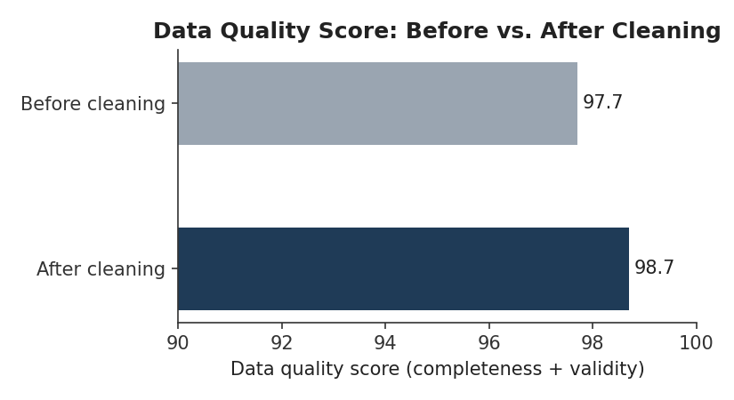
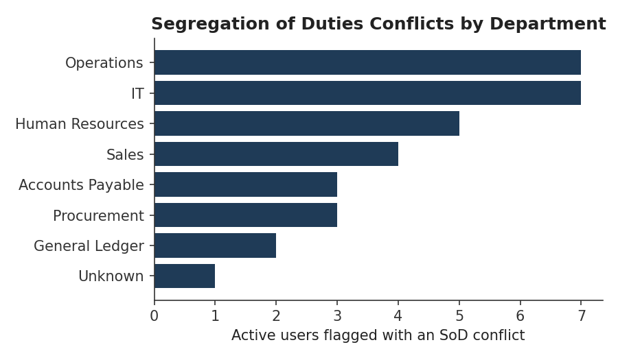
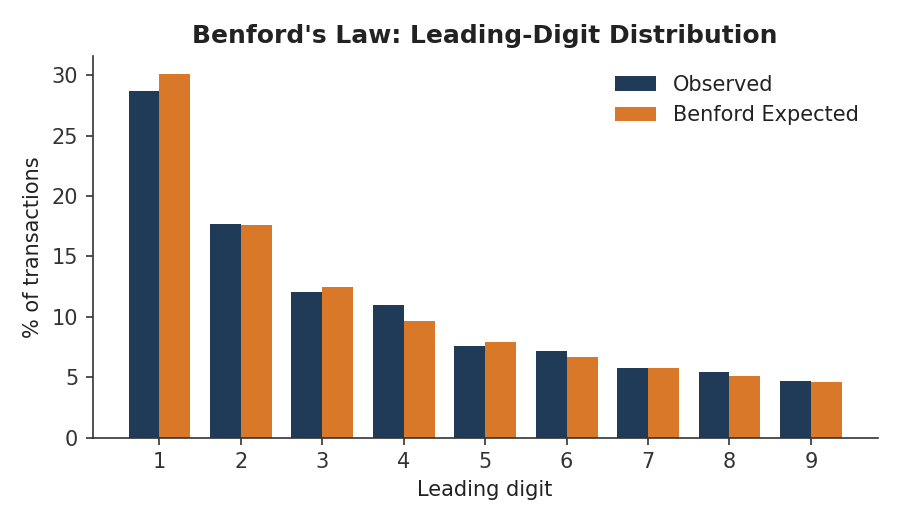
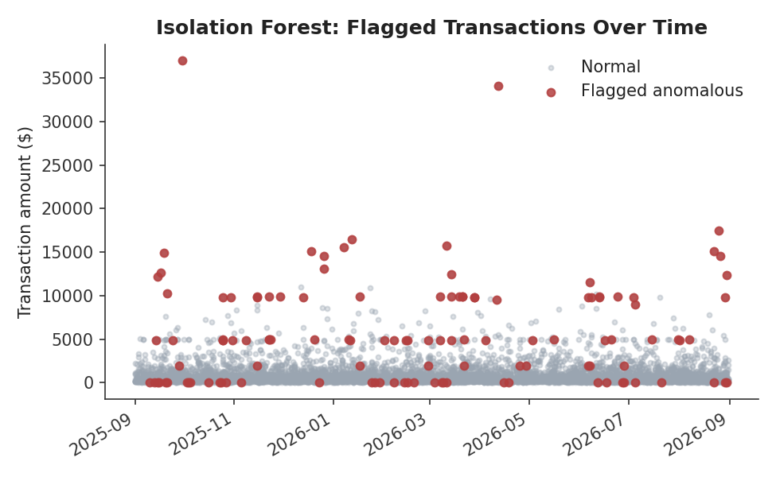

# IT General Controls & Data Assurance Analytics

A simulated audit-analytics engagement — built to mirror the kind of work done in **PwC's Digital Assurance & Transparency (DAT)** practice, as well as **EY Technology Risk** and **Deloitte Technology Controls Advisory**.

The project takes a messy, realistic mock ERP export (user access + GL transactions) and runs it through the same three-part workflow an IT/data assurance associate would: **(1)** validate the data can be trusted, **(2)** test IT General Controls (access risk, Segregation of Duties), **(3)** run substantive analytics over transactions to flag exceptions and anomalies. Results are surfaced in an interactive dashboard.

> 📌 **Why this project exists:** PwC DAT's own internship postings call for exactly this skill set — SQL, Python, data cleansing/modeling, and "learning the risk and controls in the business process and the application and database layer." EY Technology Risk and Deloitte's Technology Controls Advisory teams run the SOC/SOX/ITGC tests this project automates. I built this to show that work end to end, not just describe it.

---

## What it does

| Stage | What's tested | Techniques |
|---|---|---|
| **1. Data Assurance** | Is the data complete, valid, and de-duplicated before we trust it? | SQL completeness/validity checks, data cleansing, a composite quality score |
| **2. Access & SoD Testing** | Does anyone hold two incompatible roles? Was access revoked when someone left? | SQL self-joins against a Segregation-of-Duties conflict matrix; ITGC-style access review |
| **3. Transaction Testing** | Are transactions properly approved? Do amounts look natural? | SQL exception queries, Benford's Law, an Isolation Forest anomaly-detection model |

---

## Key findings (from the included run)

**Data Assurance**
- Scanned **6,849 records** across users, access grants, and transactions
- Data quality score improved from **97.7 → 98.7** after cleansing
- Found 8 records with a missing department, 5 malformed emails, 9 duplicate access-grant rows, and 18 access records missing an authorizer

**Access Risk / Segregation of Duties**
- **32 of 352 active users (9.1%)** hold two incompatible roles at once — e.g., the ability to both create *and* approve the same AP payment
- **24 of 48 terminated employees (50%)** still had system access that was never revoked

**Transaction Testing**
- Reviewed **6,000 GL transactions**; found 4 missing a required secondary approval and 105 clustered suspiciously just under the $5,000 approval threshold
- Benford's Law leading-digit test returned **"Close conformity"** (MAD = 0.005) at the population level — reinforcing why anomaly detection is run as a second, complementary layer rather than relying on Benford's Law alone
- An Isolation Forest model flagged **119 transactions** as anomalous; validated against a held-out set of deliberately seeded anomalies, it achieved **53.4% recall / 52.1% precision** with no labeled fraud data to train on

*(All numbers above are reproducible — see "How to run" below. Data is 100% synthetic.)*

---

## Screenshots

**Data quality improvement after cleansing**


**Segregation of Duties conflicts by department**


**Benford's Law leading-digit test**


**Transactions flagged by the anomaly-detection model**


The full interactive version of all of this lives in the Streamlit dashboard (`app.py`) — filterable tables, live KPIs, and drill-downs into every finding.

---

## How to run

```bash
git clone https://github.com/<your-username>/audit-controls-analytics.git
cd audit-controls-analytics
pip install -r requirements.txt

# Regenerate the synthetic data and re-run every test (optional --
# the repo already ships with a completed run under data/ and outputs/)
python src/run_pipeline.py

# Launch the interactive dashboard
streamlit run app.py
```

You can also deploy `app.py` for free on [Streamlit Community Cloud](https://streamlit.io/cloud) by pointing it at this repo — no server required, and it gives you a live link to share.

---

## Repo structure

```
audit-controls-analytics/
├── src/
│   ├── generate_data.py      # builds the synthetic, intentionally messy ERP export
│   ├── data_quality.py       # SQL completeness/validity checks + cleansing + scoring
│   ├── sod_analysis.py       # Segregation of Duties + terminated-access testing (SQL)
│   ├── anomaly_detection.py  # control-exception checks, Benford's Law, Isolation Forest
│   ├── charts.py             # shared matplotlib chart functions
│   └── run_pipeline.py       # runs the full pipeline end to end
├── sql/                      # the underlying SQL, as standalone .sql files
│   ├── 01_data_quality_checks.sql
│   ├── 02_sod_and_access_risk.sql
│   └── 03_transaction_control_exceptions.sql
├── data/
│   ├── raw/                  # the "as-exported" synthetic ERP data
│   └── processed/            # cleaned data used for testing
├── outputs/                  # every finding, as CSV, plus chart PNGs
├── app.py                    # interactive Streamlit dashboard
└── requirements.txt
```

---

## Methodology notes

- **Why synthetic, seeded data?** I don't have access to a real client ERP export, so `generate_data.py` builds one with a fixed random seed and *deliberately* injects known issues (SoD conflicts, orphaned access, missing approvals, anomalous transactions) so the rest of the pipeline has real things to find — and so results are fully reproducible.
- **Why validate the anomaly model against seeded anomalies?** Without labeled fraud data, there's no ground truth to measure a model against. Seeding a known set of anomalies during generation and measuring the model's recall/precision against them is a lightweight, defensible way to sanity-check detection performance before it would ever be pointed at real data.
- **Why both Benford's Law and Isolation Forest?** Benford's Law is a population-level test — it's good at catching wholesale fabrication but can stay in "conformity" even when a small subset of transactions is genuinely anomalous (which is exactly what happened here). Isolation Forest catches those individual outliers. Running both mirrors how these tests are actually layered in practice.

---

## Tech stack

Python (pandas, numpy, scikit-learn), SQL (SQLite), Streamlit, Matplotlib.

---

## Disclaimer

All data in this repository is synthetically generated for demonstration purposes. No real company, employee, or transaction data is used anywhere in this project.
